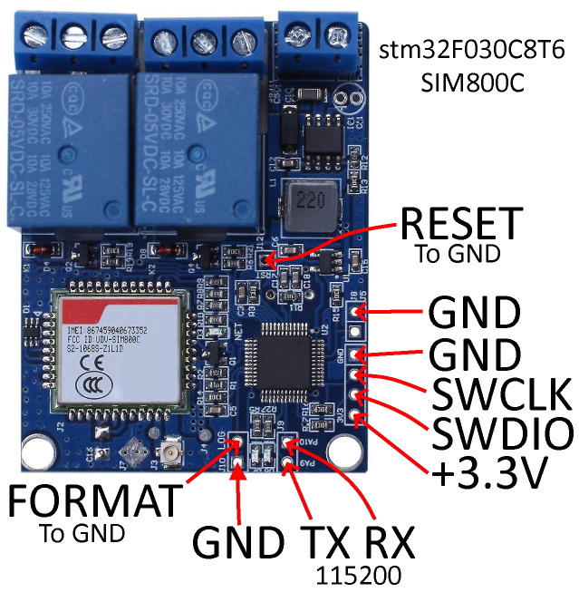
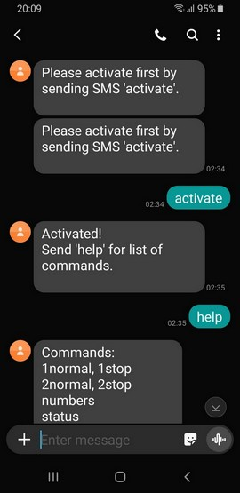
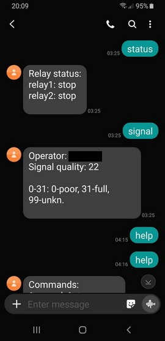
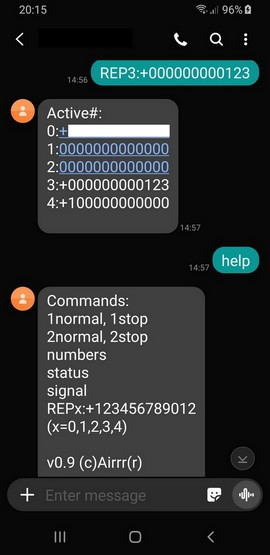

**Alternative firmware for GSM dual relay SMS board based on stm32F030C8T6 with SIM800C module.**  
  
Version: 0.9, 02.03.2025, (c)Airrr(r).  
  
&nbsp;  
  
Tested on "DIYMall UNV v3.2-2018.10-11" blue board like this:  
  
  
&nbsp;  
  
To activate the unit send SMS "activate" first. **This number will become super admin (slot A).**  
Then SMS "help" for the list of commands:  
  
|SMS command:|Help|  
|---|---|  
|1normal, 1stop|Relay commands.|  
|2normal, 2stop|Relay state will be stored in eeprom and applyed at startup if power loss happens.|  
|numbers|Get list of all 7 phone numbers allowed to control the device. (Super admins only!). Admin will receive five numbers list (0-4).|  
|status|Get relay status.|  
|signal|Get operator name and signal quality. 0 to 31 where 0-poor, 31-full, 99-unknown.|  
|REPx:+123456789012|Replace phone number with new one. Where x=A,B,0,1,2,3,4. A and B are super admins, 0-admin, 1-4 users. Phone format: +xxxxxxxxxxxx (12 digits)|  
|resetall|Reset the device to very factory defaults (all 255). Will format then (to all 0). (Super admins only!)|  
|help|Get list of commands.|  
**lower case!**  

&nbsp;  
  
To remove unwanted namber just replace him with dummy phone number like (+000000000000). (Super admins\admin only!)  
  
&nbsp;  
  
Super admin (slots A and B) can do everything.  
Admin (slot 0) can change and see numbers for 0-4 only.  
Users (slots 1-4) cannot change or see any phone numbers.  
Everyone can control the relays of course.  
  
&nbsp;  
  
Tie LOG pin to GND at startup to force device reformat (all 0). Wait and then activate with your phone #.  
  
PA9  pin - TX  Debug port: a LOT of information! May be parsed and used by another microcontroller to act somehow.  
PA10 pin - RX  @115200 3.3v  
  
Use ST-LINK to upload the firmware (swclk, swdio).  
  
&nbsp;  
  
|Serial command:|(only works while debug variable == true)|  
|---|---|  
|op|Print cellular operator name.|  
|reg|Is registered to network, bool.|  
|list|Print SMS indexes.|  
|del|Delete all SMSes.|  
|format|Same as 'resetall' SMS.|  
|signal|Print signal quality.|  
|help|Some help.|  
**lower case!**  

&nbsp;  
  
Screens:  
  

